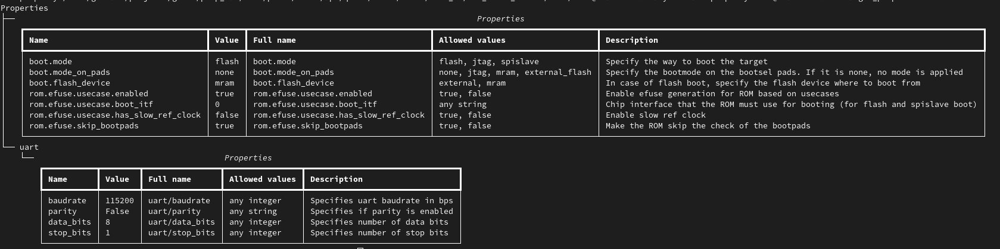

Customization
-------------

The system to be simulated is fully described by the target. This target corresponds to a Python
generator, which is responsible for instantiating, connecting, and configuring the entire set of
components needed to simulate the system.

The system can be customized using target properties, which specify high-level properties such as memory sizes.

The list of available target properties is specific to each system and can be obtained using the
*target_properties* command: ::

  gvsoc --target=gap.gap9.evk target_properties

This command will produce tables similar to the following:

Since models can declare target properties, they are hierarchical and are displayed as a tree,
with one table per model declaring at least one property.

Target properties have default values shown in the tables, which can be overridden with the
`--target-property=<path=value>` option. The path must be the hierarchical name of the target
property in the entire system.

The effect of this option can be seen in the tables. Changing a target property value can impact
the architecture of the system, which can change the list of available properties.

For example, you can change the baud rate of the UART using the following command: ::

  gvsoc --target=gap.gap9.evk --target-property=uart/baudrate=9600 target_properties